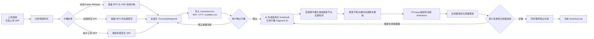

# 视频笔记生成器：处理链路与模块设计

本文描述当前代码实际执行的主链路，以及各阶段之间必须保持稳定的数据和文件契约。

## 总体流程



主链路不是一次性黑盒任务，而是两个明确的人工确认边界：

1. 视频到字幕，完成后停在“等待确认字幕”。
2. 已确认字幕到结构化笔记、关键帧和复核资料，完成后停在“等待复核笔记”。

这种拆分让字幕错误在进入 AI 概括前就能被修正，也让关键帧和正文能在最终 ZIP 生成前被人工确认。每次后台操作还会写入 `.operation.json`；程序启动时由 FastAPI lifespan 扫描未完成操作，并根据阶段决定自动续跑或等待用户重新提供远端凭据。

## 阶段职责

### API 组合与路由边界

- `backend/app/main.py` 是 FastAPI composition root，负责 lifespan、CORS、领域 router 注册、任务共享依赖、剩余任务路由和静态前端挂载。
- `backend/app/api/runtime.py` 负责 ready、health、runtime、依赖安装、模型下载和 Faster Whisper 进程内缓存释放接口。
- `backend/app/api/settings.py` 负责本地设置读取、局部更新和清空接口。
- `backend/app/api/downloads.py` 负责笔记/字幕预览、版本笔记预览、任务资产、最终 ZIP 和诊断 ZIP。它通过 router factory 接收输出目录、`JobStore` 和任务互斥上下文，不反向导入 `main.py`。
- `backend/app/api/review.py` 负责质量报告、候选帧读取/选择/拒绝、复核草稿、复核资料准备和最终定稿。它通过 router factory 注入输出目录、`JobStore`、任务互斥、revision guard 和 ZIP 构建能力，不反向导入 `main.py`。
- `backend/app/api/subtitles.py` 负责字幕确认、字幕重新生成、AI 字幕修正预览和修正应用。后台任务通过 getter 注入，既保留 operation journal 使用的真实任务名称，也允许 composition root 在运行时替换任务实现。
- `backend/app/api/notes.py` 负责笔记分块读取/重生成、笔记版本读取/切换和完整版本重生成；`backend/app/note_regeneration.py` 承载可恢复的单分块重生成后台操作，稳定保留 `_regenerate_chunk_job` operation 名称。
- `backend/app/api/jobs.py` 负责帧数建议、任务创建/历史/状态、取消、转写恢复、存储统计、转写缓存清理和删除。FFmpeg、转写、笔记建议、排队器和后台任务通过运行时 getter 注入，保留真实 operation 名称与测试故障注入能力。
- `backend/app/job_paths.py` 统一处理 job ID 校验、任务目录解析、资产路径防穿越、文本产物和元数据读取；HTTP 层负责把领域异常转换成 400/404。
- 领域 router 不反向导入 `main.py`；共享业务能力应继续下沉到 application/service 模块，避免形成循环依赖。
- `main.py` 已不再定义业务 API handler，只保留应用生命周期、上传限额 middleware、共享锁与 revision guard、请求配置构造、router 装配和静态资源挂载。

### 1. 任务创建与输入落盘

- 任务 API 由 `backend/app/api/jobs.py` 提供；`main.py` 只负责注入当前输出目录、`JobStore`、任务互斥和后台服务实现。
- 视频保存到：`outputs/{job_id}/source_video/input.{ext}`
- 可选字幕保存到：`outputs/{job_id}/source_subtitles/input.srt`
- `upload_limits.py` 统一读取视频、SRT 和最小剩余空间限制。HTTP middleware 先根据 `Content-Length` 限制 multipart 总体积，写盘时再通过受限 reader 校验实际字节数，避免缺少或伪造长度头绕过限制。
- 上传前使用目标输出盘的剩余空间做预检；视频/SRT 超限分别返回 413，空间不足返回 507。复制、探测或后续建议分析失败时，未注册的任务目录和 `.frame-suggestions` 临时目录都会删除。
- 创建任务时使用 `JobInputConfig`、可选的 `TranscriptionConfig` 和不含凭据的 `NotePreferences`。上传 SRT 的任务只需要输入配置；本地或远端转写任务只把字幕阶段配置传给转写流水线。
- 用户确认字幕、重新生成笔记、修正字幕或重生成笔记块时才构造 `NoteGenerationConfig`，此时才校验笔记 API Key、Base URL 和模型。`JobConfig` 仅保留为旧调用和测试 fixture 的兼容适配器，生产流水线不再消费复合配置。
- `JobStore` 缓存当前进程内的公开任务状态，并从权威磁盘快照、产物、复核标记和调试事件恢复历史任务视图。读取缓存状态时会合并磁盘上 revision 更高的快照，使多个应用实例能够观察彼此已经持久化的状态迁移。
- `outputs/{job_id}/.job-state.json` 是新任务公开状态的权威磁盘快照，保存 status、stage、step、进度、错误上下文、时间戳和单调递增的 `state_revision`；不保存产物 URL、下载文件名或任何凭据。普通业务更新立即原子写盘；转写中的高频秒级进度在内存中实时可见，但磁盘快照最多每 750ms 合并写入一次，分块边界、状态或阶段迁移、等待人工确认、失败、取消和完成仍立即落盘。`state_revision` 表示已持久化状态批次，只在快照实际写入时递增，因此崩溃恢复后不会因节流发生 revision 回退。
- `JobStore` 对外返回深拷贝的 `JobPublicState` 快照；业务接口不能通过修改返回对象绕过 revision 和磁盘持久化，所有公开状态变化必须调用 Store mutation 方法。
- `job_executor.enqueue_serialized` 把任务交给 FastAPI `BackgroundTasks`；FFmpeg、CPU ASR 和 GPU ASR 的重型阶段由 `resource_scheduler` 在同一进程内分别限流。
- `operation_store.py` 为每个任务保存当前后台操作；`operation_leases.py` 在 `outputs/.runtime/coordination.sqlite3` 保存跨进程 lease。`LocalJobExecutor` 同时取得进程内每任务锁和 SQLite lease，后台流水线、重新排队、版本切换、候选帧修改、复核稿保存、定稿、缓存清理和删除都使用同一入口。lease 默认有效期 30 秒、每 5 秒心跳续期；owner token 防止旧实例释放新 owner 的 lease，递增的 fencing revision 标识每次所有权变更。
- 执行器会把当前 lease heartbeat 绑定到任务线程上下文。所有通用原子文件写入、原子目录替换、笔记版本发布、候选帧目录发布、定稿、ZIP 发布和关键清理操作在提交前都会重新查询 SQLite，确认 owner token、operation ID 和 fencing revision 仍然有效。旧 owner 在 lease 过期并被更高 revision 接管后，不能再通过这些提交入口覆盖新 owner 的产物；同步 API 在提交过程中丢失 lease 时返回冲突，后台迟到执行则停止发布状态。
- FFmpeg 和本地转写等长任务继续复用取消回调。取消轮询最多每 750ms 主动复核一次当前 lease，不只等待 5 秒 heartbeat；FFmpeg 启动和返回边界也会执行 fencing 检查。程序启动恢复在修改 `.operation.json` 或 `.job-state.json` 前同样绑定已抢占的 recovery lease，若恢复 claim 在启动线程前失效，会记录为 `lease_lost` 并跳过迟到恢复。
- 取消请求不等待任务 lease，以便仍可中断正在执行的任务；`.cancelled` marker 同时作为跨进程取消信号。执行实例会从磁盘看到该 marker、停止后续普通状态写入，并在写出最终 `cancelled` 状态前合并控制实例持久化的 `cancelling` 快照。

### 2. 视频分析与音频准备

- 编排入口：`processor.process_transcription_job`
- FFmpeg 封装：`ffmpeg_tools.py`
- `probe_duration` 获取时长。
- 远端转写模式抽取 `audio.mp3`。
- 本地 Faster Whisper 模式从源视频一次生成公开 MP3 和 16 kHz 单声道 FLAC 分块，减少重复解码。
- 长视频分块、存储空间预检、取消和断点恢复都在本地转写路径中处理。

FFmpeg 的查找顺序是：系统可执行文件优先，随后使用 `imageio-ffmpeg` 随 Python 依赖提供的二进制，因此开发机不必额外把 FFmpeg 加入 `PATH`。

运行环境不使用单一“全部依赖可用”布尔值判断所有模式。`runtime_status.py` 提供能力矩阵：

- `video_processing`
- `uploaded_subtitle`
- `local_transcription_cpu`
- `local_transcription_cuda`
- `audio_transcriptions`
- `chat_audio`
- `note_generation`

其中 FFmpeg 是视频探测、音频准备和抽帧的核心依赖；Faster Whisper、CUDA 和本地模型只影响本地转写能力。远端转写即使没有安装 Faster Whisper 仍可使用，凭据和 endpoint 在任务提交时单独校验。旧 `runtime.ok` 字段保留为视频处理核心就绪状态，不再表示所有可选能力同时可用。

### 3. 字幕生成与规范化

- 转写实现：`transcription.py`
- 字幕解析和写入：`subtitles.py`
- 支持三种转写模式：
  - `local_faster_whisper`
  - `audio_transcriptions`
  - `chat_audio`
- 无论输入来自本地模型、远端 API 还是上传的 SRT，后续都统一为：

```text
TranscriptSegment(start: float, end: float, text: str)
```

统一后写入：

- `transcript.json`：后续 AI 与复核功能使用的结构化源数据
- `subtitles.srt`
- `subtitles.vtt`
- `subtitles.md`

完成后任务进入 `awaiting_subtitle_confirmation`。此时不会提前调用笔记模型。

### 4. AI 概括与结构化笔记

- 主实现：`llm.py`
- 版本和 Markdown 落盘：`note_versions.py`、`markdown.py`
- 输入是已确认的时间戳字幕，不是原始视频。
- 模型必须返回结构化 `NoteDraft`，核心字段包括：
  - 标题和摘要
  - 带开始/结束时间的章节
  - 章节起止字幕引用 `start_segment_id`、`end_segment_id`
  - 关键结论和行动项
  - `key_moments`：适合抽帧的字幕 `segment_id`、兼容时间点、原因和章节索引

短字幕可以单次生成；长字幕会按字符数和时间间隔分块，先生成局部草稿，再执行 reduce 合并。分块结果保存到 `note_chunks/`，支持后续单块重生成。

每条 prompt 字幕都带有由毫秒时间范围和字幕文本摘要组成的稳定 Segment ID。模型输出经过 JSON 提取、Pydantic 校验和无效 JSON 重试后，后端用真实字幕片段重新计算章节边界和关键帧时间：

- 有效 Segment ID 是权威引用，模型返回的数字秒数只是兼容提示。
- 旧模型只返回数字时间时，后端吸附到包含该时间或距离最近的字幕片段。
- 章节起止引用反转时，后端按时间顺序归一化。
- 章节重新排序后，关键时刻的章节索引同步映射。
- 明确引用字幕片段且数字时间位于该片段内时，保留更精确的数字时间；越界时使用片段中点。

字幕经过人工修正后，旧 `note_chunks/`、笔记版本、帧和复核资料都会失效，必须基于新字幕重新生成。

### 5. 从字幕语义时间点抽取关键帧

- 时间点选择：`frame_selection.py`
- 实际抽帧：`ffmpeg_tools.extract_frame`
- 笔记版本创建：`note_versions.create_note_version_from_draft`

关键帧不是直接对每条字幕机械截图。流程是：

1. AI 根据带时间戳字幕在 `NoteDraft.key_moments` 中给出高信息量时间点。
2. 后端把时间点限制在视频有效范围内。
3. 在默认 4 秒窗口内去重，避免连续相似帧。
4. 如果模型没有返回关键时间点，则使用章节中点；没有章节时使用视频中点。
5. FFmpeg 在目标时间抽图，失败时依次尝试稍早时间和视频起点。
6. 抽出的帧路径写回笔记 Markdown，并随笔记版本保存。

这使“字幕语义”和“视频画面”通过秒级时间轴关联，而不需要额外视觉模型。

每个笔记版本还会保存校准后的 `draft.json` 与 `evidence.json`。证据索引记录字幕指纹、章节覆盖的 Segment ID，以及关键时刻绑定的 Segment ID。质量报告会重新验证引用是否仍能在当前字幕中解析，并检查章节中的数字与技术标识是否能在绑定字幕原文中找到。该检查用于发现模型擅自改变数字、版本号或缩写的风险，不等同于对外部世界事实的完整核验。

### 6. 候选帧、质量报告与人工复核

- 候选帧：`frame_candidates.py`
- 质量检查：`review_quality.py`
- 复核草稿：`review_drafts.py`
- 定稿：`review_finalization.py`

初版笔记生成后，系统优先从当前笔记版本的结构化 `draft.json` 读取章节、校准后的关键时间和正文摘要；只有旧任务或手工版本缺少结构化草稿时，才兼容解析 `note.md`。随后系统为每章扩展关键时间点和 25%/50%/75% 章节位置的候选帧，并附上邻近字幕与笔记摘要。

每个候选语义锚点会在章节边界和视频有效范围内采样 `-1.0s`、`-0.5s`、`0s`、`+0.5s`、`+1.0s` 的低分辨率灰度帧。所有任务时间点统一去重，并由 FFmpeg 每批最多处理 24 个样本。系统通过相邻灰度帧的平均绝对差估算稳定度和转场风险：

- 锚点本身稳定时优先保留原时间。
- 锚点落在转场或快速动画中时，优先选择距离较近、画质合格的后侧稳定画面。
- 后侧画质明显较差时仍可选择前侧稳定画面。
- FFmpeg 或样本分析失败时回退到原语义锚点，不中断整个任务。

稳定时间确定后才抽取高清候选图。每张候选图再经过两类确定性静态分析：

- 感知哈希：标记跨章节或同章节的近似重复画面。
- 灰度画质：从 FFmpeg 解码的低分辨率灰度像素计算亮度、极暗/极亮比例、对比度和拉普拉斯清晰度，标记黑屏、白屏、欠曝、过曝、低对比度和疑似模糊。

这些指标不增加 Pillow、OpenCV 或视觉模型依赖。系统先避开黑/白屏和明显转场，再避开重复候选，最后综合静态画质、场景稳定度、转场惩罚和“笔记关键点”来源为每章选择默认帧。复核界面会显示画质、稳定度、相对语义锚点的时间偏移及风险标签，用户仍可覆盖自动选择。

用户可以选择、取消或拒绝候选帧，也可以编辑分章节正文。`ReviewDraft` 优先由当前版本的结构化 `draft.json` 和 `evidence.json` 构建；兼容旧任务时才解析 Markdown。它会为每段保存字幕 Segment ID、字幕指纹和当前证据检查结果；用户保存正文后，系统会基于该段绑定的字幕重新检查数字和技术标识。质量报告优先读取结构化 `ReviewDraft`，使用用户实际编辑的正文和实际选择的帧，不再把 Markdown 反向解析结果或全局默认候选当作人工定稿状态。黑屏、白屏或人工选中的转场帧作为需要处理的问题。定稿时只复制被选中的候选帧，重写最终 `note.md`，同步当前笔记版本，并保存最终 Markdown 指纹以便定稿后继续审计，再生成 ZIP。

首次生成、完整笔记重生成和单分块重生成都经过同一个复核准备入口：清理旧 ZIP、重建候选帧、重建质量报告、写入 `.note-review.pending`，最后进入 `awaiting_note_review`。任何重生成路径都不会绕过人工复核直接标记成功。

复核资料的 HTTP 接口区分命令和查询：

- `POST /api/jobs/{job_id}/review-assets/prepare`：显式准备或刷新候选帧、人工复核稿和质量报告，属于会写任务目录的命令，并受每任务写锁保护。
- `GET /api/jobs/{job_id}/frame-candidates`：只读取已准备的候选帧索引。
- `GET /api/jobs/{job_id}/review-draft`：只读取已准备的人工复核稿。
- `GET /api/jobs/{job_id}/quality-report`：只读取已准备的质量报告。

因此浏览器刷新、请求重试或预加载不会暗中启动 FFmpeg、创建复核稿或改写质量报告。前端打开人工审核、保存人工正文后刷新质量结果时，会明确调用 prepare 命令。

## 一致性与原子写入

- 通用写入实现：`atomic_io.py`
- 文本和 JSON 先写入同目录唯一临时文件，刷新并 `fsync` 后通过 `os.replace` 提交。
- 字幕、转写 checkpoint、分块笔记、笔记版本索引、候选帧索引、复核草稿、质量报告、取消标记和复核标记都使用统一原子写入。
- 定稿切换根 `frames/` 时先把旧目录移动到备份；新目录切换失败会恢复旧目录。
- ZIP 使用同目录临时文件构建并替换，且通过 dirty marker 防止旧 ZIP 被误当作最新产物。
- 面向用户的 `download.zip` 不包含 `debug.log` 或 `debug/` 下的模型原始响应；诊断资料由独立的 `diagnostics.zip` 下载接口按需重建，避免分享最终笔记时意外携带内部响应和错误上下文。
- 定稿先在 `review/finalization_staging/` 准备最终正文、最终帧和最终复核稿，再写 `review/finalization.json`。发布中断后会从同一 staging 幂等重放；只有质量报告和 ZIP 都成功发布后才清除 `.note-review.pending`。

这些机制保证单个关键文件不会留下半写入内容，并降低目录切换失败时丢失旧版本的风险。它们不等同于跨多个文件的数据库事务；阶段边界仍由 operation journal、恢复 marker、定稿 manifest 和每任务 lease 共同协调。

## 当前恢复边界

| 阶段 | 中断后行为 | 当前能力 |
| --- | --- | --- |
| 本地分块转写 | 启动时自动恢复操作，并复用与源文件和执行计划匹配的已完成块 | 自动续转 |
| 上传 SRT 解析 | 重新读取已落盘的源字幕和视频 | 自动重跑 |
| 远端转写 | 不持久化凭据，标记为等待转写服务凭据 | 用户重新提交后重试 |
| AI 笔记生成 / reduce | 不持久化凭据，标记为等待笔记服务凭据 | 用户重新提交后重试 |
| 笔记已生成、正在抽帧或准备复核 | 从现有笔记版本重建候选帧和质量报告 | 自动续跑 |
| 等待字幕/笔记复核 | marker 是磁盘恢复点 | 可恢复到复核界面 |
| ZIP 构建 | dirty marker 阻止发布旧包，重建后原子替换 | 可安全重建 |

`.job-state.json` 保存面向 API 和前端的权威任务状态；`.operation.json` 只保存当前命令的操作类型、阶段、进度、尝试次数、恢复次数、非敏感参数和凭据类别（如 `note_service`），不保存 API Key、Bearer Token 或请求正文。marker 只作为字幕确认、笔记复核、取消和 ZIP 提交等崩溃交界的恢复点。新任务恢复时优先读取任务状态快照，再用 operation 和 marker 协调崩溃边界；没有快照的旧任务才从产物和 debug 事件推断，并自动迁移出首个快照。历史列表只读取协调结果，不在查询过程中创建 marker。

新的操作会生成新的 operation ID，旧任务的迟到状态更新不能覆盖新操作。恢复实例先用 SQLite 事务抢占该任务 lease，成功并通过提交前 fencing 检查后才更新 `.operation.json` 的 recovery claim；另一个实例遇到有效 lease 时只记录 `already_claimed`，不会修改任务状态。lease 过期或正常释放后的下一任 owner 获得更高的 fencing revision，旧 owner 的心跳、释放和受 guard 保护的文件提交都不会命中新 owner。

当前已经具备单机共享输出目录下的跨进程互斥、提交前 cooperative fencing 和恢复抢占，但仍不是分布式任务队列：任务正文仍由 FastAPI BackgroundTasks 或桌面进程内线程执行，`.operation.json` 仍是每任务可读 journal，多个产物文件的提交也不是单一数据库事务。SQLite 校验与本地文件系统 `os.replace` 之间仍不是同一原子事务；若后续扩展为多主机服务，应把 operation 本身、任务队列和产物提交记录统一迁入数据库或专用队列，并使用能够在存储层原子校验 fencing token 的共享存储。

## 核心产物契约

| 路径 | 生产阶段 | 主要消费者 |
| --- | --- | --- |
| `source_video/input.*` | 创建任务 | 转写、抽帧、重新生成 |
| `audio.mp3` | 音频准备 | 下载、远端转写 |
| `work/asr/` | 本地转写 | 分块断点恢复 |
| `transcript.json` | 字幕阶段 | AI 概括、字幕修正、质量报告 |
| `subtitles.srt/.vtt/.md` | 字幕阶段 | 预览、下载、笔记附录 |
| `note_chunks/` | 长字幕概括 | 单块重生成、reduce |
| `note_versions/{id}/note.md` | 笔记生成 | 版本切换、预览和 ZIP |
| `note_versions/{id}/draft.json` | 笔记生成 | 保留后端时间校准后的结构化草稿 |
| `note_versions/{id}/evidence.json` | 笔记生成 | 字幕证据追踪与质量检查 |
| `note.md` | 当前激活版本/定稿 | 前端预览、ZIP |
| `frames/` | 当前激活版本/定稿 | Markdown、前端预览、ZIP |
| `review/frame_candidates.json` | 复核准备 | 候选帧 UI、定稿 |
| `note_versions/{id}/review/review_draft.json` | 人工复核 | 最终正文、选帧和字幕证据审计记录 |
| `review/quality_report.*` | 复核准备 | 质量提示 |
| `metadata.json` | 全流程 | 恢复、历史列表、重新生成 |
| `download.zip` | 最终定稿 | 用户下载 |
| `diagnostics.zip` | 用户显式请求诊断包 | 失败排查；不属于最终笔记成果 |

修改任何稳定产物名时，需要同时检查 `processor.create_zip`、`JobStore` 的产物扫描、FastAPI 下载接口和前端预览/下载逻辑。

## 前端模块边界

- `App.tsx`：页面导航、工作台切换、快捷键与功能 Hook 装配。
- `TaskConfigPanel.tsx`：受控的视频/SRT 选择、笔记语言/风格/帧数/额外要求，以及创建、取消和继续转写按钮；不直接发起 API 请求或拥有任务状态。
- `SettingsModal.tsx`：设置弹窗外壳、本地配置保存入口和运行环境总览；从 `App.tsx` 接收按 `modal`、`note`、`transcription` 分组的受控输入。
- `SettingsTranscriptionSection.tsx`：转写来源和语言的公共入口，根据模式装配本地或远端转写设置。
- `SettingsLocalTranscriptionSection.tsx`：Faster Whisper 模型、性能档位、设备/精度、本地路径、Python/CUDA 依赖安装和模型下载状态。
- `SettingsRemoteTranscriptionSection.tsx`：OpenAI-compatible 远端转写 Base URL、模型和 API Key。
- `SettingsNoteApiSection.tsx`：笔记生成 Base URL 预设、模型和 API Key。
- `ResultWorkbench.tsx`：受控的结果下载、工作台导航、笔记/字幕/关键帧预览、笔记分块管理和人工复核入口；输入按 `context`、`downloads`、`frames`、`note`、`subtitle` 领域对象分组，不拥有任务轮询、当前任务身份或跨功能异步编排。
- `FrameReviewModal.tsx`：人工正文编辑、字幕证据提示、候选帧选择、候选预览，以及章节到笔记分块的匹配。
- `QualityStatusControl.tsx`：质量分数、状态和问题类型的展示映射。
- `RuntimeStatus.tsx`：当前流程能力徽章、FFmpeg、本地转写、外部 Python、CUDA、模型目录和配置路径诊断。
- `TranscriptCorrectionModal.tsx`：AI 字幕术语修正的逐段差异预览与采用确认。
- `JobHistoryPanel.tsx`：历史任务列表与删除入口。
- `WorkbenchNavigation.tsx`：任务摘要与结果工作台导航。
- `useJobResources.ts`：按任务、笔记版本和 `artifact_revision` 加载字幕、笔记、分块、候选帧、质量报告与复核稿；统一取消旧请求并隔离迟到响应。
- `useSubtitleWorkflow.ts`：集中编排字幕确认、字幕重生成、AI 字幕修正和修正应用；验证请求所属任务，并用任务 ID 与操作 epoch 隔离任务切换后的迟到响应。
- `useNoteWorkflow.ts`：集中编排笔记版本切换、整体/分块重生成和最终定稿；保留 state/artifact revision 冲突保护，并统一取消版本切换请求、回滚预览选择及隔离迟到响应。
- `useReviewWorkflow.ts`：集中编排人工复核资料准备、段落保存、质量报告刷新和复核弹窗状态；保存请求继续携带 revision guard，并在任务切换后忽略迟到结果。
- `useRuntimeTasks.ts`：集中管理 Faster Whisper 模型下载、本地转写依赖安装和 CUDA 依赖安装；三类任务共用非重叠递归轮询、启动失败状态映射、卸载保护和完成后的运行环境刷新。
- `useSettings.ts`：以单一 `UserSettings` 状态对象管理全部设置字段，负责默认值、启动读取、类型化字段更新、保存、清空、卸载保护和变更后的运行环境刷新。
- `useJobLifecycle.ts`：拥有当前任务状态、主任务非重叠轮询、历史列表、历史任务载入、取消、继续转写和删除；通过显式回调清理输入与下游派生资源，并隔离卸载或快速切换后的迟到结果。
- `useJobCreation.ts`：拥有视频/SRT 文件选择、创建前环境校验、`FormData` 构造、本地模型下载入口和任务创建请求；通过 operation epoch 忽略清空输入、任务切换或卸载后的迟到响应，并与 `useJobLifecycle.ts` 显式协作清理文件输入。
- `useHealthState.ts`：拥有运行环境健康状态、启动阶段非重叠重试、显式刷新和请求取消；用 request epoch 与卸载保护避免旧健康检查覆盖新结果。
- `api.ts`：复用的后端请求和错误解析。
- `openapi.json` / `api.generated.ts`：由 FastAPI OpenAPI 和 `openapi-typescript` 生成的权威 API schema、路径与组件类型；生成文件记录 OpenAPI SHA-256。
- `types.ts`：对生成组件提供稳定的业务别名，只手写 Markdown 预览、pywebview 桥接和轮询状态等纯 UI 类型。带默认值的响应列表在这里收紧为运行时必有字段。

`/api/runtime`、`/api/health` 和 `/api/jobs/{job_id}/note-chunks` 均声明正式 response model。运行环境聚合模型位于 `runtime_models.py`；`get_runtime_status()` 在返回字典前会先经过 `RuntimeState` 校验，因此命令行调用、测试和 FastAPI 响应使用同一份结构约束。

后端 schema、导出的 `frontend/openapi.json` 和 `frontend/src/api.generated.ts` 由 `backend/tests/test_openapi_contract.py`、生成文件指纹以及前端 `check:api` 共同校验。修改 Pydantic 模型或 FastAPI 路由后执行：

```powershell
.\scripts\generate-api-types.ps1
```

功能组件只接收类型明确的 props 和回调，不直接拥有任务轮询或全局任务切换逻辑。任务配置、运行环境和结果工作台视图已经拆出；健康状态、任务创建、字幕、笔记、人工复核、运行环境任务、设置持久化和主任务生命周期分别收敛到对应功能 Hook。`App.tsx` 主要保留页面导航、快捷键和跨功能装配。

`JobPublicState.updated_at` 表示任务状态或进度更新时间；`artifact_revision` 只由字幕、笔记、版本索引、笔记分块、候选帧、质量报告、复核稿和复核 marker 等用户可见派生产物决定。前端不再因为调试日志或普通进度更新而重复读取全部派生资源。任务轮询使用前一次请求完成后再安排下一次请求的递归定时器，避免慢请求与下一轮轮询重叠。

人工复核相关写请求使用乐观并发控制：新版前端在版本切换、候选帧选择或拒绝、复核段落保存和定稿时同时提交 `expected_state_revision` 与 `expected_artifact_revision`。后端在每任务写锁内部刷新产物并比较 revision；状态或产物已经变化时返回 409，且在冲突检查通过前不会修改任务目录。旧客户端未提交 revision 时保持兼容，但不具备迟到请求保护。

## 关键不变量

- API Key 不写入任务目录、元数据、调试日志或 ZIP。
- 本地设置使用 schema v2 envelope；Windows 下 API Key 由当前用户作用域的 DPAPI 加密，旧版明文配置只作为兼容输入并在下一次保存时迁移。
- 设置保存、清空和依赖安装触发的局部更新共用进程内锁与跨进程文件锁；锁内重新读取当前设置，通过唯一同目录临时文件、`fsync` 和原子替换提交，避免多个桌面实例竞争固定临时文件或覆盖彼此的局部更新。密文损坏或 provider 不匹配时拒绝覆盖原文件。
- `/api/ready` 保持低成本，不触发模型、CUDA 或外部 worker 探测。
- 前端根据当前选择的字幕来源读取对应 runtime capability，不用 Faster Whisper 的状态推断远端流程是否可用。
- 未确认字幕时不生成笔记；未完成笔记复核时不开放最终 ZIP。
- 模型必须引用字幕 Segment ID；后端从真实字幕时间轴派生权威章节和关键帧时间，展示层再格式化为 `HH:MM:SS`。
- 字幕修正会使所有旧笔记分块和下游复核资料失效。
- 所有笔记生成和重生成路径最终都进入 `awaiting_note_review`，只有人工定稿才能生成最新 ZIP。
- `note.md` 与根目录 `frames/` 始终代表当前激活或最终定稿版本。
- 所有笔记版本路径必须位于任务目录内，版本切换采用临时文件和备份目录降低半写入风险。
- 所有状态承载 JSON、Markdown 和 marker 使用同目录临时文件原子替换。
- 单机共享输出目录内，每个任务同一时间只允许一个持有有效 SQLite lease 的后台或同步写操作修改任务目录；关键文件与目录提交前必须再次校验当前 fencing revision。
- operation 日志不保存 API Key；需要远端调用的中断操作等待用户重新提交凭据。
- 本地模型不会在任务开始时静默下载；模型下载必须由用户显式触发。

## 本地开发入口

初始化并验证环境：

```powershell
.\scripts\init-dev.ps1 -Verify
```

启动后端：

```powershell
.\.venv\Scripts\python.exe -m uvicorn backend.app.main:app --reload --host 127.0.0.1 --port 8000
```

启动前端：

```powershell
npm --prefix frontend run dev
```
